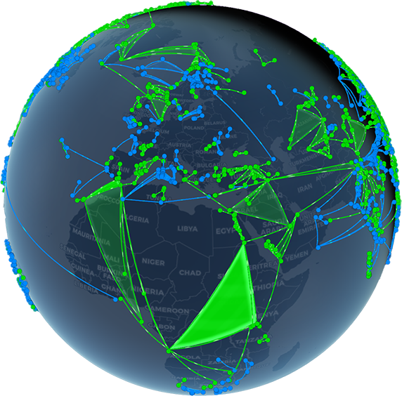

<h1 align="center">IITC Globe View</h1>

  

  
  
  

  Links and fields on IITC map but on a proper globe with fancy shaders and graphics as options!

  

<h1 align="center">What is it?</h1>

IITC shows links on a flat 2D map by default like regular intel, this IITC plugin gives you a nice 3D globe with various graphic options and you can easily switch between the regular and Globe View. It's more of a novelty plugin and does not guarantee compatibility with other plugins, feature requests are open. It currently supports regular link, portal and field display with various graphic options either as eye candy or for screenshot composition when you build fields and want to show them off to the wider community. It is using Cesium for the globe itself. 
  

# IITC Globe View

### Explore the Intel map as a live, interactive 3D globe.

[✨ Features](#features) · [📦 Installation](#installation) · [⚙️ Settings](#settings) · [📸 Screenshots](#screenshot-mode) · [⚡ Performance](#performance)

> [!NOTE]
> Globe View is an unofficial visual plugin for [IITC-CE](https://iitc.app/). It is not affiliated with Niantic, Ingress, or the IITC-CE project.

## What it does

Globe View turns the currently loaded IITC map into an interactive Cesium-powered globe. Portals, links, and fields already available to IITC are projected onto the globe, with map imagery beneath them.

It does **not** request additional Intel data. If Intel has not loaded a portal, link, or field, Globe View cannot show it. Pan, zoom, and use IITC normally; Globe View mirrors the data IITC has loaded.

## Features

- Interactive globe camera with mouse controls, **North up**, to restore the canera location after you orbit around the globe by holding down **CTRL button.**  Return-to-map controls to go back to regular IITC default map view.
- Links with Arc, Flatter, and Flat geometry styles; optional faction-coloured directional energy flow (GPU).
- Portals rendered as adaptive batched dots or detail badges, with selection, outlines, beacons, and resonance effects.
- Field-only rendering that matches IITC: fields are fills, while link visibility remains separately controlled.
- Glass, shimmer, raised-prism, and animated **Energy Canopy (GPU)** field styles.
- Day/night lighting, atmosphere, cloud veil, sun disc, solar rim flare, coordinate grid, and north-to-south resonance sweep.
- CSS space backdrop or GPU nebula with stars, dust lanes, shooting stars, and polar aurora.
- Screenshot composition tools for focusing on selected portals, fields, or a marked area.
- Low, Balanced, and Quality presets, plus a fully custom configuration.
- Diagnostics for data coverage, map focus, loaded tiles, imagery source, anti-aliasing, and FPS.

## Installation
0: It is NOT RECOMMENDED on mobile devices, even on a high-end phone with the Low graphics it was laggy, use it on PC ONLY! But you can try of course, regular IITC didn't load the map at all and the globe remained solid colored (Won't fix) but the globe loaded up on IITC Prime (Newer mobile IITC) BUT it remained laggy!
1. You need [IITC-CE](https://iitc.app/).
2. Have a userscript manager (Not tested with IITC button but feel free to try and report back)
3. [Click here to install](https://github.com/Falenone/IITC-Globeview/raw/refs/heads/main/globe-view.user.js) from this repository and install the script. It would appear under Map category.
4. Reload Intel, then select **Globe** from the IITC toolbox.

The first activation downloads CesiumJS. After that, Globe View can be opened with the **Globe** toolbar button; **Globe settings** opens the configuration dialog. You can also have it auto open always when opening intel when you enable it from Globe settings and check the **Open Globe automatically after refresh** checkbox
## Using the globe

- Drag to rotate and pan around Earth; use the mouse wheel to zoom.
- Hold down **CTRL** button to orbit around the current area (Graphical glitches may occur as it's not a full 3D game) But you can get nice mild angles of your links and fields if you want to screenshot them!
- **North up** resets the camera after orbiting using **CTRL** button.
- **Return to map** closes the globe and returns to standard IITC and all nothing related to the globe remains unless you click on Globe from the toolbox again.
- Clicking a globe portal works like regular IITC portal click.
- Clicking a portal link in IITC COMMs moves the active globe to that location.
- At IITC’s portal-detail zoom, portals, links, and fields align to their Intel positions. Overview views use lifted geometry where appropriate for readability and graphics display reasons to avoid clipping and such. It has been downsized a little so you need to zoom in a little more to get it to show All links, Portals etc to remain snappy and not lag with thousands upon thousands of fields and portals. It can work well as your everyday glance at the map view but do not use this for mission critical OPs, I am not responsible for "Oh shit this link wasn't actually blocking our lane even though the globe showed it was and now we ran out of XYZ and can not do the OP" and stuff like this, it's a novelty plugin after all.

## Settings

All settings apply immediately. Selecting a named profile changes its visual controls; changing an individual profile-controlled value switches to **Custom**.

### Performance profiles

| Profile | Intended use | Visual treatment |
| --- | --- | --- |
| **Low** | lower-end GPUs | Data layers only; optional visual effects disabled. |
| **Balanced** | Everyday Intel use | Clear lighting and smooth edges with restrained effects. This is the default for a fresh installation. |
| **Quality** | Powerful desktops and showcase views | Enables richer globe, nebula, aurora, motion, and portal effects. |
| **Custom** | Personal tuning | Preserves your individual choices. |

### Graphics

#### Display

- Profile selector
- Tile brightness, contrast, and saturation
- Smooth link edges (**FXAA**)
- Fog
- Glow and glow intensity

#### Globe and lighting

- Atmospheric rim and atmospheric entry glow
- Day/night shading
- Open Globe automatically after refresh
- Live or manual UTC lighting time
- Sun disc and sun halo
- Solar rim flare
- Space background and background drift (Lightweight)
- GPU nebula and drifting stars **(GPU)**

#### Globe accents and nebula

- Coordinate grid
- North-to-south resonance sweep - Mimics the old pulse effect from ingress
- Cloud veil - Mild clouds on the globe
- Nebula palette: Cosmic, Emerald, or Sunset
- Nebula density, deep dust lanes, and dust-lane intensity
- Nebula/star drift
- Star flicker, flicker speed, star size, and star density

### Links and fields

#### Links

- Show/hide links
- Shape: **Arc**, **Flatter**, or **Flat**
- Link endpoint highlights and colour
- Directional energy flow (GPU)
- Separate Enlightened, Resistance, and Machina flow colours
- Pulse length: Short, Medium, or Long
- Flow opacity, arc height, line width, and line opacity

#### Fields

- Show/hide field fills independently from links
- Field fill opacity
- Field styles:
  - **Glass** — clean faction-coloured translucent fill
  - **Shimmer glass** — smoky moving internal highlight
  - **Raised prism** — elevated field surface at overview scale
  - **Energy canopy (GPU)** — curved, anchored membrane with a restrained animated rim
- Shimmer strength (Mimicing the beta screenshots of Ingress prime's fields)

### Picture mode

Screenshot mode hides Globe UI and enables high-quality capture settings without adding Intel requests.
This mode acts as a "secret" Ultra graphics preset as this setting ONLY turns off when you turn it off!

- Screenshot mode and screenshot glow
- Camera presentation: Off, Slow orbit, or Cinematic fly-in
- Screenshot orbit speed
- Animated field shimmer, field depth haze, and field caustics
- Shooting stars and density
- Polar aurora, intensity, palette, and drift motion

#### Screenshot composition

Composition filters apply only while Screenshot mode is enabled.

- Show all loaded fields, fields in a marked area, fields touching the current portal, or fields from pinned portals
- Choose the selected field only, nested fields, parent fields, or an entire field family
- Mark an area with three or more globe points, then filter by all vertices, field centre, or intersection
- Independently include Enlightened and Resistance fields
- Exclude a clicked field, clear all filters, or capture a PNG

### Portals

- Renderer: Auto, detail billboards, batched dots, or Off (Keep it at auto)
- Detail badges at close zoom
- Selected-portal highlight
- Faction resonance rings
- Portal beacons for the selected portal or selected plus high-level portals
- Beacon intensity
- Portal outline, colour, and width
- Portal size and maximum portal count

### Camera

- Slow auto-rotate and rotation speed
- Cinematic fly-in whenever Globe View opens
- Fly to a clicked portal

### Debug

- Show/hide Globe UI
- Diagnostics panel with FPS
- Globe focus marker
- Leaflet viewport, IITC tile coverage, and individual debug tiles
- Credits

## Screenshot mode

For a clean composition:

1. Enable **Screenshot mode** in Globe settings and any effects you wish that are Screenshot-mode-only.
2. Select a field or portal on the globe, or use **Mark area points**. around the area you wish to display
3. Choose the desired composition filter and faction visibility.
4. Optionally enable canopy fields, aurora, caustics, presentation motion, and glow.
5. Use **Capture PNG** or your browser’s screenshot tools. No IITC sidebar, COMM etc is shown (unless you have exotic plugins and it's displaying means is exotic)

## Performance

Globe View is designed to keep the loaded Intel data responsive as much as possible:

- Geometry is batched where it gives a meaningful improvement, especially for portals and links.
- Details adapt by camera height and loaded data density. Zoom levels have been toned down which means you need to zoom it further to get all portals loaded for example.
- Expensive shaders and animations are optional, labelled **GPU**, or reserved for Screenshot mode.
- The Low profile disables all optional eye candy and fancy effects; Balanced is a good daily-driver baseline.
-  Screenshot mode also acts as secret "Ultra" graphics preset, the setting doesn't get turned off after a refresh, only when you deliberately turn it off. So you can have all screenshot mode only effects enabled if you want.
Dense areas may lag regardless depending on your graphics options and your computer's capabilities.

## Data, imagery, and limitations

- Globe View renders only the portals, links, and fields IITC currently has loaded and loads nothing extra, it actually loads less stuff as the zoom level stuff has been toned down a notch to keep the globe snappy- which means IITC can show briefly at the bottom right "Portals" and it instantly switches to all links and you need to keep zooming in a little more to actually see "Portals".
- Imagery follows the compatible IITC base-map setup where possible and falls back safely when a provider cannot be reproduced by a globe imagery layer. Google map layers are currently not supported
- WebGL support is required. If Cesium cannot load, check the Inspect element console and browser WebGL support.
- NOT RECOMMENDED ON MOBILE! It may or may not work but it will be laggy as all hell!

## Credits

Created by **Falenone** with **OpenAI Codex**.

3D globe rendering is powered by [CesiumJS](https://cesium.com/cesiumjs/). IITC is provided by the [IITC-CE community](https://iitc.app/).

## License

It's AI slop so I guess creative commons, do whatever you want with it, rub it in flat-earther's face or whatever. Enjoy it! That's the main part!

---

Bugs report to me directly in Telegram or here in Github
